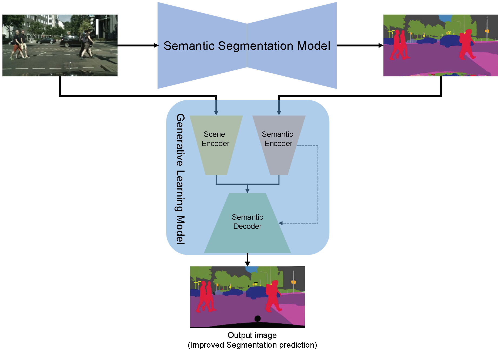
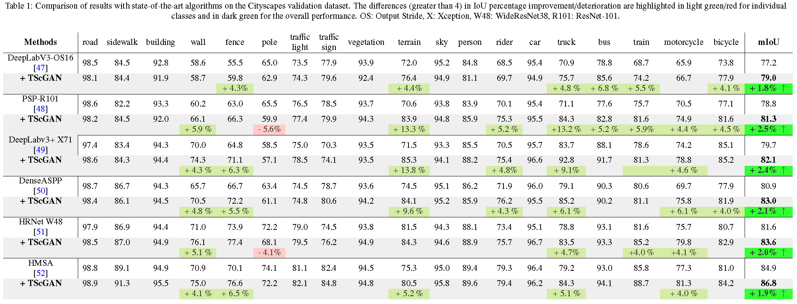

# TScGAN-for-Improving-Semantic-Predictions
A Two-Stream Conditional Generative Adversarial Network (TScGAN) for Improving Semantic Predictions in Urban Driving Scenes

The proposed scheme is a Two-Stream Conditional Generative Adversarial Network (TScGAN), with one stream having initial semantic segmentation masks predicted by an existing CNN while the other stream utilizes scene images to retain high-level information under a supervised residual network structure. In addition, TScGAN incorporates a novel dynamic weighting mechanism, which leads to significant and consistent gain in segmentation performance.

Please refer to our [paper]() for more details.

# Download

Click [here]() to download the code. 

The pretrained models are found in [TScGAN]()

# Results - TScGAN

Several comparative tests on public benchmark driving databases, including Cityscapes, Mapillary, and Berkeley DeepDrive100K, demonstrate the effectiveness of the proposed method when used with state-of-the-art CNN-based semantic segmentation models.

Download the high-quality image results by clicking [here](https://drive.google.com/drive/folders/12Ndd-Wtwf3_ReWTh2EMVxR-W6kF9g_-x?usp=sharing)
# Citing TScGAN
If you find this framework useful in your work, please cite the paper: 

# Contributions
If you find any issue running the code, you can report it in the issues section.

# Acknowledgements
University Technology Belfort-Montbrliard, France [UTBM](https://www.utbm.fr/)
Connaissance et Intelligence Artificielle Distribuées [CIAD](http://www.ciad-lab.fr/)

# Inspiration
We hope that this will benefit the community and researchers working in the field of autonomous driving.
